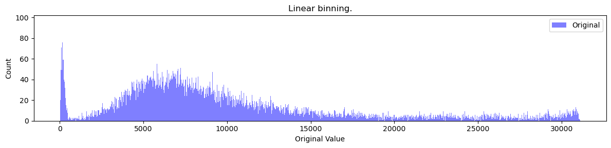
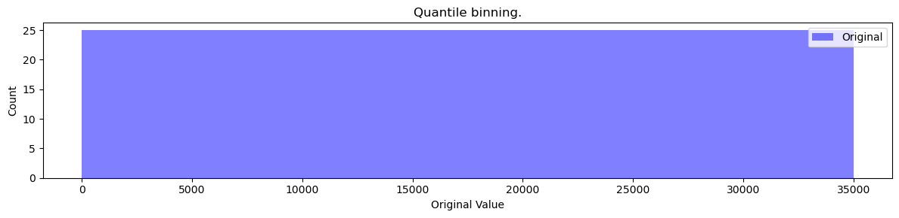

# Tokenization #

This does not explain the tokenization code. For that see the comments in `tokenizer.py` and `untokenizer.py`. This also does not cover how to configure tokenization. For that see `dictionary.md`. The goal is to explain how we go from Geant4 data from the [MCGenerators](https://github.com/xju2/MCGenerators/tree/main/G4/HadronicInteraction) script to our tokenized data.

## Discretization ##

MCGenerators outputs continuous data (to 5 decimal places). We discretize this data into chunks for the GPT to train on.

#### Linear tokenization ####

Linear tokenization uses even bin widths. An example of linear binning on the pt (transverse momentum) distribution is the following:

Linear binning provides the most straight forward representation of the data. Put simply, the continuous data is discretized to be fed into the GPT. Importantly, the shape of the distribution is retained.

#### Quantile tokenization ####

Quantile tokenization attempts to ensure all data is evenly represented in the dataset. The goal is to have each bin occur roughly en equal number of times in the dataset.

An example of quantile binning on the pt (transverse momentum) distribution is the following:

Clearly, each bin (there are 35,000) have equal count. It should be noted that this is an example of perfect quantile binning. Quantile binning is often imperfect in which case each bin will have roughly equal occurrence but not exactly equal.

One issue with quantile binning is reconstruction. Linear binning retains the shape of the distribution, quantile binning clearly does not. The ability to reconstruct the quantile binned data into the correct bins is directly proportional to the number of bins used. More bins => better reconstruction. A down side is more bins means a higher vocabulary size which implies longer training, more compute, and potentially worse performance. These factors much be accounted for when using quantile binning.

Some distributions cannot be reconstructed well when quantile binning. Therefore, it is important to test the reconstructibility of a feature before using quantile binning.

#### Gaussian tokenization ####

Gaussian tokenization follows a gaussian curve for tokenization. The peak of the gaussian curve is where the bin width is smaller leading to finer bins. As the curve trails off on both ends, the bin width increases leading to coarser bins.

Gaussian tokenization is useful in the case where peaks of a distribution are overrepresented and the tails of a distribution are overrepresented. Gaussian tokenization suppresses the peaks and accentuates the tails of a distribution.

## Padding ##

GPT training requires uniform tensors. This is accomplished by padding each event to the same number of particles.

The MCGenerators script outputs only real particle per collision. The format for MCGenerators output is `(incoming x 1, outgoing x N(event))`, where N is the number of outgoing particles. There is always one incoming particle. N varies based on the event (is a function of the event).

The padding phase restructures the data to `(incoming x 1, outgoing x M)`, where `M` is `max(N(all events))`. The padding particle can be configured in the dictionary (see `dictionary.md`).