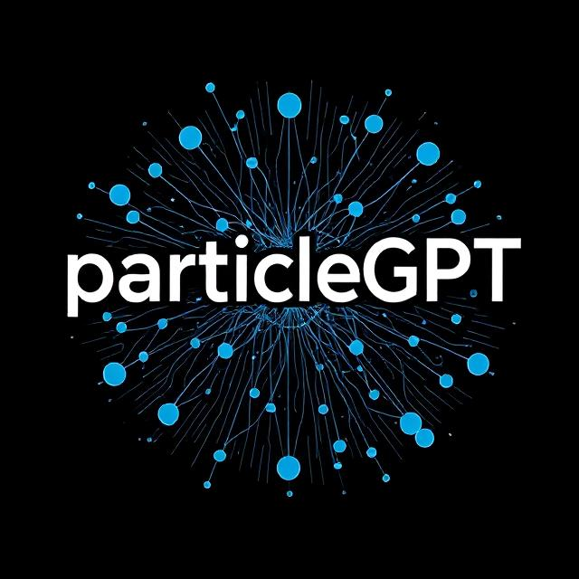

# ParticleGPT #

GPT based on nanoGPT for generating particle collision data.



###### Generated by deepai.org ######

## Dependencies ##

- https://github.com/karpathy/nanoGPT is the base project.
- https://github.com/scikit-hep/particle used for PDGID conversions.
- https://github.com/scikit-hep/vector used for vector things.
- https://github.com/jet-net/JetNet/tree/main is used for numeric metrics.

## Usage ##

For usage, see `usage.md`.

## Notes ##

```shell
# Running interactive job:
srun -C "gpu" -q interactive -N 1 -G 1 -c 32 -t 4:00:00 -A m3443 --pty /bin/bash -l
srun -C "gpu" -q interactive -N 1 -G 4 -c 32 -t 4:00:00 -A m3443 --pty /bin/bash -l
srun -C "gpu&hbm80g" -q interactive -N 1 -G 4 -c 32 -t 4:00:00 -A m3443 --pty /bin/bash -l
srun -C "cpu" -q interactive -N 1 -c 128 -t 4:00:00 -A m3443 --pty /bin/bash -l

# Training on a single node, multiple GPUs (4 here)
torchrun --standalone --nproc_per_node=4 train.py config/model_to_train.json

# Training on a specified GPU
CUDA_VISIBLE_DEVICES=0 python train.py config/model_to_train.json

# Profiling scripts using cProfile:
python -m cProfile -o output_file_name.profile script_to_profile.py

# Visualizing profiling using snakeviz:
# Make sure to use the port that ssh tunnels
snakeviz output_file_name.profile -p 8080 -s
```

```shell
# Dataset and num events
dataset_1 has 10,000 events
dataset_2 has 100,000 events
dataset_3 has 10,000 events
dataset_4 had 1,000,000 events
dataset_5 has 10,000,000 events
dataset_6 has 100,000,000 events
```